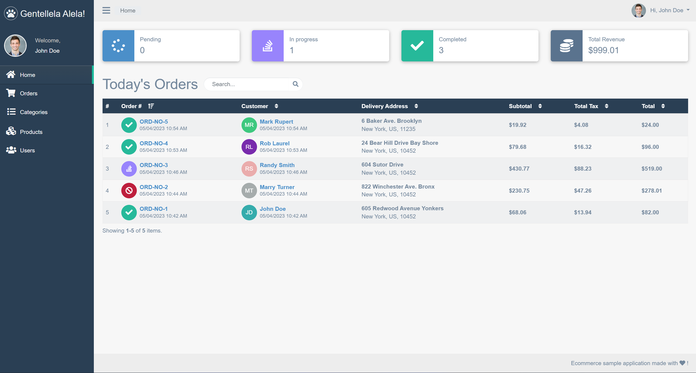
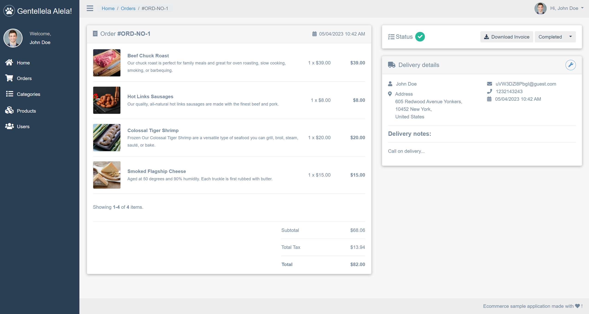
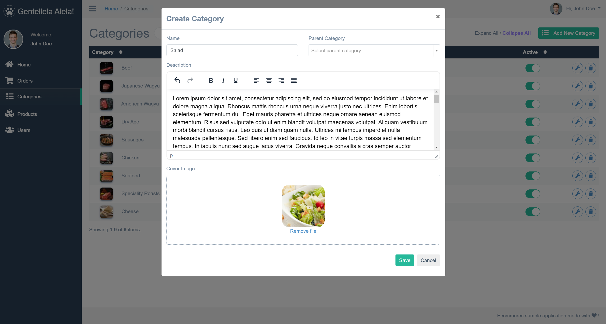
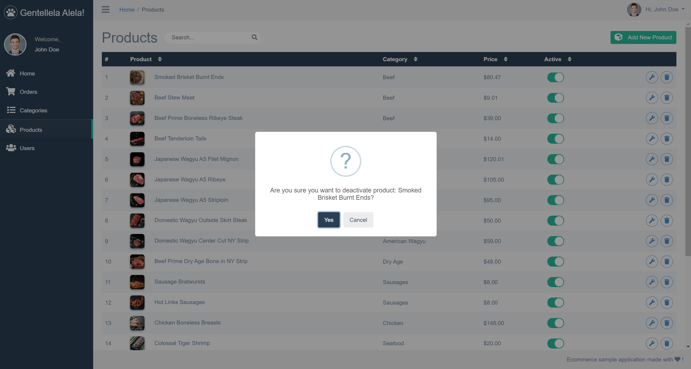
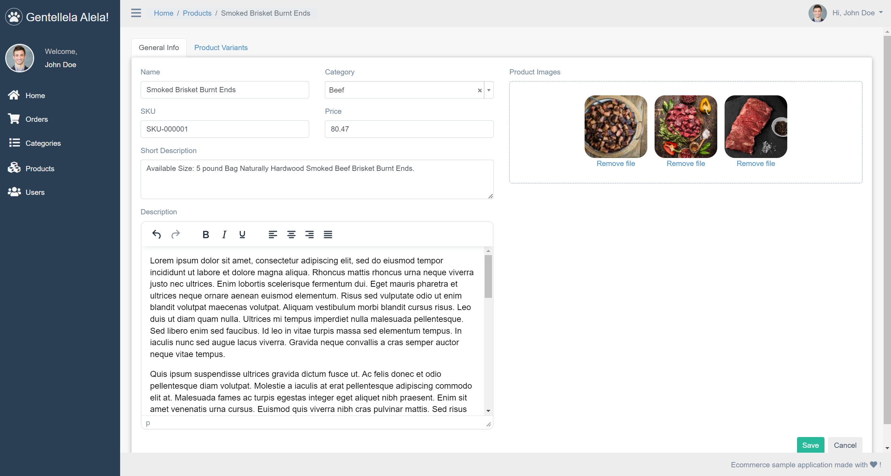

# Ecommerce Template App

- [Introduction](#Introduction)
- [Instalation](#Instalation)
- [Technologies](#Technologies)
- [Directory structure](#Directory-Structure)
- [Demo](#Demo)
- [License](#License)

## Introduction

This is a dockerized e-commerce sample project that introduces all the main concepts of a modern e-commerce application.
The purpose is to create a customizable and extensible template and save me a lot of time on repetitive work in feature projects.

## Instalation

### Development

1. Navigate to a following directory: `cd docker/dev`
2. Run command: `docker-compose -p ecommerce_template_local up --build`
3. Run command: `winpty docker-compose exec api bash` and in the docker container:
   - Navigate to `application/api` subdirectory
   - Run `apt-get update`
   - Run `composer install`
   - Run `php init` and chose in which environment you want to run it
   - Run `php yii migrate`

### Production

1. Navigate to a following directory: `cd docker/prod`
2. Run command: `docker-compose -p ecommerce_template_prod up --build`
3. Run command: `winpty docker-compose exec api bash` and in the docker container:
   - Navigate to `application/api` subdirectory
   - Run `apt-get update`
   - Run `composer install`
   - Run `php init` and chose in which environment you want to run it
   - Run `php yii migrate`

## Technologies

    ├── FRONTEND                             # Angular 14
    ├── ADMIN PANEL                          # Yii2 PHP Framework
    ├── RESTFUL API                          # Yii2 PHP Framework
    ├── WEBSERVER                            # Nginx

## Directory structure

    ├── api                                  # Yii2 RESTFUL API application
    ├── backend                              # Yii2 ADMIN PANEL application
    ├── frontend                             # Angular 14 FRONTEND application
    ├── console                              # Yii2 CONSOLE application
    ├── common                               # Contains shared portion between api, backend and console application
    ├── environments                         # Contains environment-based overrides
    ├── vendor                               # Contains dependent 3rd-party packages
    ├── docker                               # Dockerization config
    │   ├── dev
    │   │   ├── frontend
    │   │   │   ├── Dockerfile               # frontend container build instructions
    │   │   ├── nginx
    │   │   │   ├── default.config           # Nginx default configuration
    │   │   ├── php-fpm
    │   │   │   ├── Dockerfile               # php-fpm container build instructions
    │   │   │   ├── pho-ini-overrides.ini    # Config for overriding php.ini settings
    │   │   ├── .env                         # Environment variables
    │   │   ├── docker-compose.yml           # Docker compose boilerplate file
    │   │   ├── docker-database.env          # Database environment variables
    │   ├── prod
    │   │   ├── nginx
    │   │   │   ├── Dockerfile               # Nginx container build instructions
    │   │   │   ├── default.config           # Nginx default configuration
    │   │   ├── php-fpm
    │   │   │   ├── Dockerfile               # php-fpm container build instructions
    │   │   │   ├── pho-ini-overrides.ini    # Config for overriding php.ini settings
    │   │   ├── .env                         # Environment variables
    │   │   ├── docker-compose.yml           # Docker compose boilerplate file
    │   │   ├── docker-database.env          # Database environment variables
    ├── logs                                 # Nginx access/error logs
    ├── composer.json
    ├── composer.lock
    └── README.md

## Demo

### Frontend

### Admin Panel

#### Dashboard

#### Order Details

#### Categories

#### Products

#### Product Details

## License

This project is licensed under the MIT License.